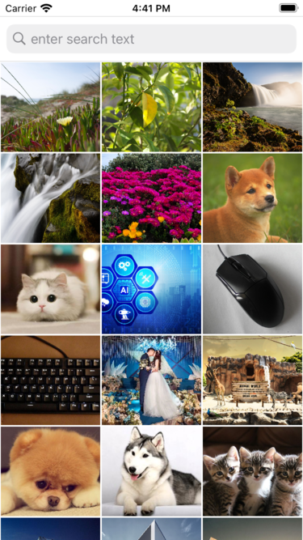

# Mobile Text-to-Image Search(MoTIS)
MoTIS is a minimal demo demonstrating semantic multimodal text-to-image search using pretrained vision-language models. Semantic search represents each sample(text and image) as a vector in a shared semantic embedding space. The relevance score can then be measured as similarity(cosine similarity or distance) between vectors.

# Recent Updates:
+ We use pretrained ViT-Small as initialization for the student model and it achieves even better results(2 points higher Hit@1) than thr previous Deit-small-distilled model. Link of the jit scirpt checkpoint is [here](https://drive.google.com/file/d/1s_oX0-HIELpjjrBXsjlofIbTGZ_Wllo0/view?usp=sharing).
+ A more effective distilled image encoder(84MB compared to the original 350MB ViT-B/32 in CLIP) is available [here](https://drive.google.com/file/d/1Fg3ckUUqBs5n4jvNWZUcwwk7db0QBRri/view?usp=sharing). This image encoder is initialized with [DeiT-base-distilled](https://github.com/facebookresearch/deit)'s pre-trained weights, which leads to more robust image representation hence better retrieval performance(obtain higher Hit@1/5/10 than original CLIP on MSCOCO validation set). It is further learned through supervised learning and knowledge distillation.
+ Transplanted Spotify's [Annoy](https://github.com/spotify/annoy) Approximate Nearest Neighbor search in this project(annoylib.h).
+ A distilled ViT image encoder is provided [here](https://drive.google.com/file/d/1Miocgk0gxAf79pu51IX8kfR04iJM_TCm/view?usp=sharing), with a much smaller size of 48MB compared to the original 351MB one while retaining decent retrieval performance. For knowledge distillation, we use the union of [Google Conceptual Captions](https://ai.google.com/research/ConceptualCaptions/) and [MS COCO](https://cocodataset.org/#home) as paired image-caption data. The distillation objective is to minimize the KL divergence(w.r.t teacher model's output log-probability dis) and cross entropy loss(w.r.t groud truth). The codebase is built on top of an open-sourced implementation of CLIP. Link to the repo is [here](https://github.com/mlfoundations/open_clip).
+ Relatively low quality images are displayed by default. Retrieved images are displayed with high quality. This is designed to reduce the runtime memory.

# Features
1. text-to-image retrieval using semantic similarity search.
2. support different vector indexing strategies(linear scan, KMeans, and random projection).

# Screenshot
+ All images in the gallery  
+ Search with query **Three cats** 

# Installation
1. Download the two TorchScript model files([text encoder](https://drive.google.com/file/d/1583IT_K9cCkeHfrmuTpMbImbS5qB8SA1/view?usp=sharing), [image encoder](https://drive.google.com/file/d/1Miocgk0gxAf79pu51IX8kfR04iJM_TCm/view?usp=sharing)) into models folder and add them into the Xcode project.
2. Required dependencies are defined in the Podfile. We use Cocapods to manage these dependencies. Simply do 'pod install' and then open the generated .xcworkspace project file in XCode.
```bash
pod install
```
3. This demo by default load all images in the local photo gallery on your realphone or simulator. One can change it to a specified album by setting the **albumName** variable in **getPhotos** method and replacing **assetResults** in line 117 of GalleryInteractor.swift with **photoAssets**.

# Usage
Just type any keyword in order to search the relecant images. Type "reset" to return to the default one.

# Todos
+ Basic features
- [x] Access to specified album or all photos
- [x] Asynchronous model loading and vectors computation
- [x] Export pretrinaed CLIP into TorchScript format using **torch.jit.script** and **optimize_for_mobile** provided by Pytorch
- [x] Transplant the original PIL based image preprocessing procedure into OpenCV based procedure, observed about 1% retrieval performance degradation
- [x] Transplant the CLIP tokenizer from Python into Swift(Tokenizer.swift) 
+ Indexing strategies
- [x] Linear indexing(persisted to file via built-in Data type)
- [x] KMeans indexing(persisted to file via NSMutableDictionary, hard-coded num of clusters, u can change to whatever u want)
- [x] Spotify's [Annoy](https://github.com/spotify/annoy) libraby with random projection indexing, the size of index file is 41MB for 2200 images.
+ Choices of semantic representation models
- [x] OpenAI's CLIP model
- [ ] Integration of other multimodal retrieval models
+ Effiency
- [x] Reducing memory consumption of models: runtime memory 1GB -> 490MB via a smaller yet effective distilled ViT model.

# About Us
This project is actively maintained by [ADAPT](http://adapt.seiee.sjtu.edu.cn/) lab from Shanghai Jiao Tong University. We expect it to continually integrate more advanced features and better cross-modal search experience. If you have any problems, welcome to file an issue.
